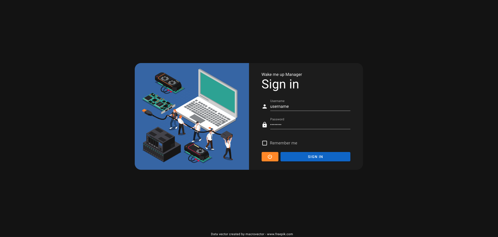
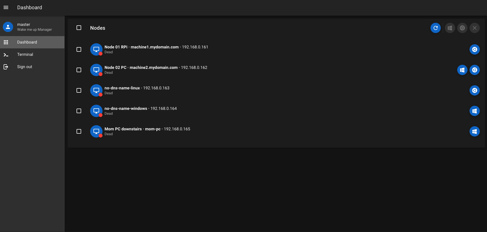
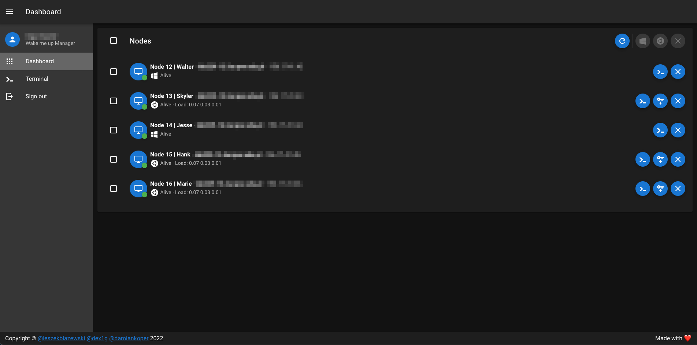
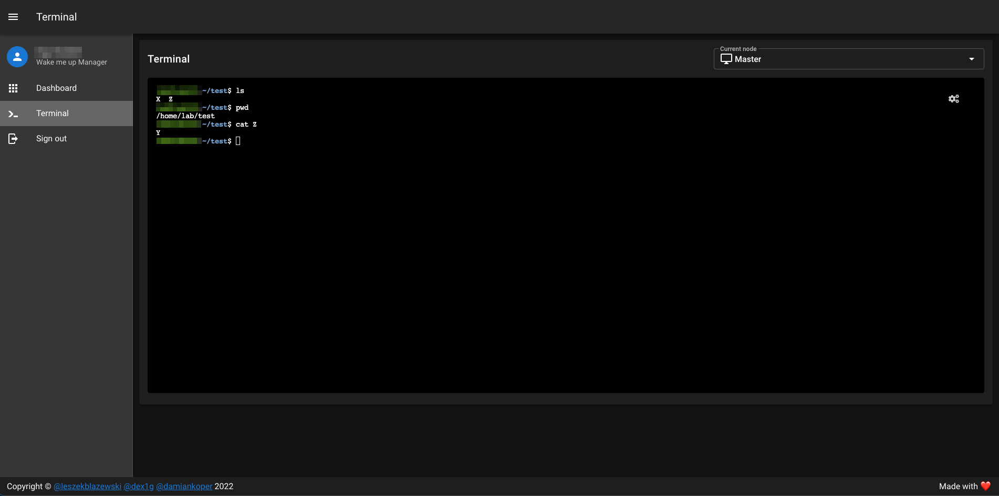
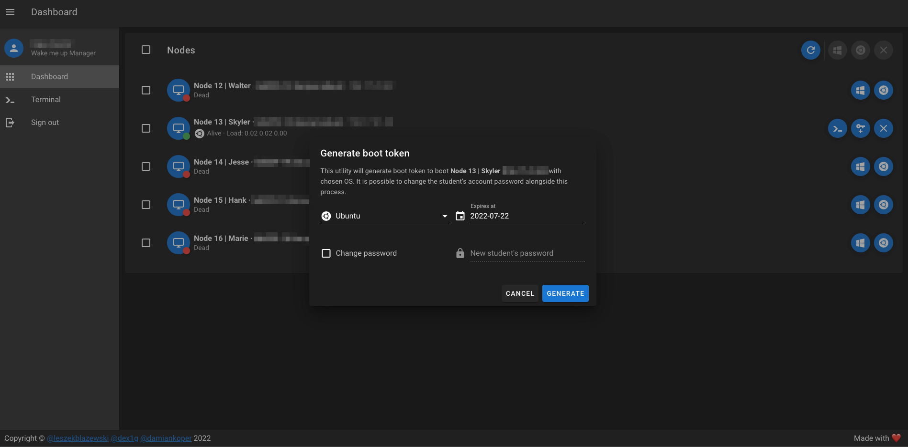
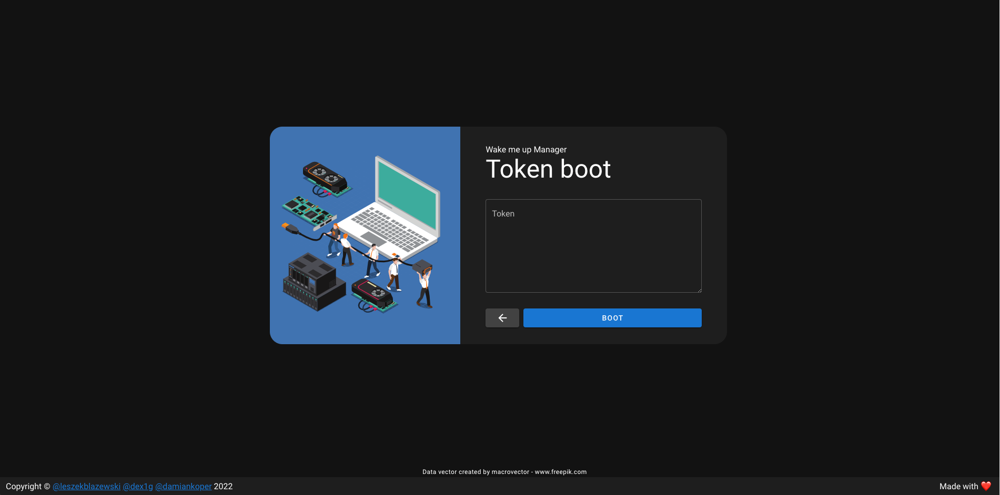

# Welcome to Wake me up Manager!

Finally after all this searching you found the tool which allows turning on demand your home machines and securely connecting to them from anywhere, just using your browser!

# Description

This tool allows:

- Managing all your home machines wih simple easy to use webpanel
- Turning on any machine in your local network which is connected via ethernet and can be woken up with Wake on Lan
- Booting given system flavour on demand for machines which are setup with dual boot
- Connecting to all your machines via SSH directly from the browser
- Generating tokens so given hosts can be woken up without signing in to the application

So no more running all your home PCs all the time! Simply deploy the app on a small device like a PI and boot other machines when you need them! Supports both HTTP if you don't own a domain and HTTPS with free Let's Encrypt cert if you have one.

... and some screenshots

Sign in page. The access is protected with JWT token.



Main dashboard which shows all your machines. Turn on/off single/multiple machines with requested OS at once. For Linux instances also the load will be displayed.





Interactive terminal for connecting to any of the hosts. Based on [wetty](https://github.com/butlerx/wetty).



Generating new token in order to be able to wake up given machine without the need to sign in into the panel. This is a JWT token for which expire date is set and after it, the token is invalid and can't be used anymore. Changing student password is an additional feature which is described in [Why did we built this tool](#why-did-we-built-this-tool).





# How does it work?

1. Waking up machines

The first step is waking up given machines, which is done with Wake on Lan standard to turn on any ethernet connected hosts inside given network (note that WoL works based on MAC addresses and the packet can't be routed, therefore we are speaking about one subnet and VLAN).

2. Choosing OS to boot

The second step consists of bootig chosen distribution. We had the requirement to be able to boot Linux/Windows on demand because all the machines were running dualboot.

This is solved by using a similar pattern which PXE boot is built. We use the UEFI GRUB network capability durning boot to query our microservice for the target OS that should be booted when the machine starts. The GRUB simply sends a request on machine startup to ip address of the host running the wake up manager app, then the built in inside api TFTP server, based on the requested configuration returns the `set default="${bootTarget}"` variable which tells GRUB which OS to boot.

3. Connecting to woken up machines

After the machines are woken up we use SSH with a jump host on the master server (the one serving the wake me up manager app) to connect to other machines. Here [wetty](https://github.com/butlerx/wetty) is configured to allow the connection to the main host and then from it we make a SSH jump to other requested node.

The details of the required configuration on both master (the host running the wake up manager) and other hosts is explained in detail in [How do I run it?](#how-do-i-run-it).

# Why did we built this tool?

Despite the fact that PXE covers some of the aspects the built application solves, we did not find a tool that covers all of our requirements. Mainly we needed to cover the below scenario:

1. There is a laboratory that has multiple machines connected in same network where no virtualisation or PXE was introduced.
2. The main operating system that is used is Windows.
3. There are multiple classes happening and many students have access to different accounts.
4. The PCs can only be accessed during the class. There is no way to remotely access the hosts.

**Targets**

1. Allow remotely waking up hosts on demand.
1. Allow remote access to the hosts.
1. Allow students to wake up assigned machines and have remote access so they can work outside the class hours.
1. Centralized management of all of the hosts without interfering with the current setup, so the lecturer will be able to quickly launch all of the PCs and shut them down when needed.
1. Not interfering with the current setup (windows is used daily and must be booted each time when the power on button is pressed) - basically the users inside the laboratory shouldn't be aware that there is also a linux server available to boot.
1. In case the app crashes/does not work, windows should be booted at all times no matter what.

That's why there is a `student` account on the machines, for which we can change the password from within the application when generating the token. This allows passing the token and password to given student, so he/she can wakeup the machine on demand and connect to it.

Because of the last point, the app was written in such a way that whenever boot request is sent, we launch requested OS by modifying the `set default="${bootTarget}"` variable and in case the request for the variable times out we still have the `GRUB_DEFAULT` variable setup so the default system (in our case Windows will be launched), check the next section for details.

# How do I run it?

## Requirements

The whole stack requires some configuration, so read the below instructions carefuly, configure both the master and the nodes accordingly. Deploy wherever you want with docker-compose. ARM is also supported so you can use your Raspberry as a gateway for waking up and accessing your home machines.

### Prerequisites

1. Create a SSH key pair that will be used to connect to all of your machines. The host running the wake me up manager uses just one key when making the jump from the master node to others, so the key will be added to all of the machines.

### Hosts that will be waken up and connected to

1. Ensure that your machine supports wake on lan, is in the same network/subnet as the host running the application and is connected via ethernet cable.
1. Enable Wake on Lan in BIOS and on all of the systems (if you run dualboot, make sure to enable it both on Linux and Windows for example). Here are instructions for [ubuntu](./wol/ubuntu/README.md) and [windows](./wol/windows/README.md).
1. Enable the SSHD daemon (Yeah Windows has this built in, just enable it) and add the created public key to authorized_keys, so you can connect from the host running the app.
1. Allow the user accounts that are used during SSH connection to shut down the machines without password for sudo. This is needed because the app simply connects to given host and issues `sudo shutdown now` when shutdown is requested from the panel. In Linux for user `lab` this can be done simply with:

```bash
echo 'lab ALL=(ALL) NOPASSWD: /sbin/poweroff, /sbin/reboot, /sbin/shutdown' > /target/etc/sudoers.d/labnopass
chmod 440 /target/etc/sudoers.d/labnopass
```

4. **If you need the choose system to boot functionality**

This step is optional because it's not needed for the app to work properly. If you run only one system on the given machine, you can **safely skip this step**. If you need it, you need to ensure that the following requirements are met:

- Your machine has the settings for net boot in BIOS enabled
- Your machine uses UEFI
- Your machine is booted via GRUB
- GRUB recognizes your network card

You can check this by going to GRUB console on boot and issue the following commands:

```bash
insmod net
insmod efinet
net_bootp
net_ls_cards
```

And you should see your network card model with its MAC. If you see `no netwok card found` make sure your card model is able to network boot and if yes check BIOS settings for additional network boot options and enable them. Also compability settings like CSM/UEFI/BIOS might be needed to be setup correctly.

If all of the above is met proceed with:

1. Login into Linux and edit the file `/etc/grub.d/40_custom`

**Keep the existing entries and add the below ones**

```sh
set_timeout_style=hidden # optional if you want GRUB to not show up
set_timeout=0            # optional if you want GRUB to not show up

insmod net
insmod efinet
insmod tftp

net_bootp
source (tftp,{{master-ip}}:6969)/grub_config # Make sure to change {{master-ip}}
```

**`{{master-ip}}`** - replace the variable with the Ip address of the machine that will be running wake me up manager application. The GRUB will send a TFTP request to the master machine each time the host starts and the TFTP server on port 6969 will answer with `set default="${bootTarget}"` and that will be the OS to boot.

**`grub_config`** - This can be any string, simply put something after the `/` so the request reaches the TFTP server!

2. Modify the `/etc/default/grub` file:

```
GRUB_DEFAULT={{0/1/2/3}}
```

**`{{0/1/2/3...}}`** - replace with one of the numbers, this is the default GRUB entry that should be booted in case the master application fails for some reason. Note: **The entries are indexed from 0!**

3. **Don't forget to update GRUB!**

```
sudo update-grub
```

### Host running the wake me up manager application

1. Ensure that the machine is connected with ethernet to same network/subnet as all of your hosts configured in the previous step.
2. Enable the SSHD daemon and configure it with the following setting:

Create the file `/etc/ssh/ssh_config.d/nodes.conf`:

```
Host 192.168.0.*
    IdentityFile ~/docker-compose-dir/config/ssh_key
    UserKnownHostsFile /dev/null
    StrictHostKeyChecking no
```

Where **Host** is the subnet in which all your machines reside and IdentityFile points to the file with `ssh_key` created in the previous step. This is necessary to allow wetty seamless SSH jumps to other machines just with one SSH key.

3. Add the created public key to the authorized_keys list. It will be used by wetty to connect to the main server.
4. Install docker and docker-compose.
5. Copy the [docker-compose.prod.yml](./docker-compose.prod.yml) file to your server.
6. **If you don't own a domain and want a HTTP setup**, replace the code for proxy service inside the copied yml with code of the proxy service from [docker-compose.yml](./docker-compose.yml).
7. Create a directory in same dir where you copied the docker-compose file named `config`.
8. Copy either the [default-ssl.conf](./config/default-ssl.conf) or [default.conf](./config/default.conf) in there (as names say, default-SSL is for the HTTPS setup, default.conf for HTTP).
9. Place the private ssh key which was generated at the beginning inside the created `config` folder. This is the private key to which public key was added to all of the other hosts that we will be managing.
10. Create the host list inside `config` directory, named `hosts.yml` for your machines. The file will be parsed by the application at startup. A sample file can be found [here](./config/hosts.example.yml).

Details of the variables:

**Note: Many of those variables are YAML strings, it might be wise to quote them.**

| Variable name    | Example value         | What it does                                                                                                                                                             |
| ---------------- | --------------------- | ------------------------------------------------------------------------------------------------------------------------------------------------------------------------ |
| Node name        | machine1.mydomain.com | The DNS name of the machine if there is one, if not can be any string, used only for display.                                                                            |
| ip               | 192.168.0.161         | The ip address of the machine, used for SSH connection                                                                                                                   |
| mac_address      | B5-BE-D6-34-57-F0     | The MAC address of the network card, used for sending Wake on lan packets                                                                                                |
| name             | Node 1 - Mom's PC     | Can be any string, used only for display.                                                                                                                                |
| username_linux   | linux_alabama         | Name of the user that will be used in username_linux@ip for SSH connection, when connecting to LINUX OS. If you want to wakup only Windows, you can skip this variable   |
| username_windows | windows_alabama       | Name of the user that will be used in username_windows@ip for SSH connection, when connecting to Windows OS. If you want to wakup only Linux, you can skip this variable |

9. Create the `.env` file inside the **same** folder as copied `docker-compose.yml` file. You can use [.env.example](./.env.example) file for reference. This will be used when issuing `docker-compose up` to provide the overrides for the default values. Most of the variables have sensible defaults, so you can let them be, but few of them need to be adjusted. Below is the list with details:

| Variable name                  | Example value            | What it does                                                                                                                                                                                                               |
| ------------------------------ | ------------------------ | -------------------------------------------------------------------------------------------------------------------------------------------------------------------------------------------------------------------------- |
| BASE_DOMAIN                    | mycooldomain.com         | If you use HTTPS setup, provide **just** the name of the domain (used by Let's Encrypt for cert validation)                                                                                                                |
| BASE_URL                       | https://mycooldomain.com | Full url to the application, make sure to correctly set either `https` if SSL is used or `http` otherwise                                                                                                                  |
| LOG_VERBOSITY                  | 3                        | How much logs do you want to see in `docker logs` output for `api` service                                                                                                                                                 |
| AUTH_USERNAME                  | admin                    | username used for logging into the dashboard                                                                                                                                                                               |
| AUTH_PASSWORD                  | admin123                 | password used for logging into the dashboard                                                                                                                                                                               |
| SECRET                         | sdfhsdfhskdfhksdhfjk     | Secret for signing JWT tokens (come up with something strong and interesing)                                                                                                                                               |
| EXPIRES_IN                     | 1h                       | How long the JWT token for signing in is valid                                                                                                                                                                             |
| SECRET_REFRESH                 | ytrjyrbtyjhbrthjybrt     | Secret for signing JWT tokens (come up with something strong and interesing)                                                                                                                                               |
| REFRESH_EXPIRES_IN             | 1d                       | How long the JWT token for refhreshing is valid                                                                                                                                                                            |
| REFRESH_REMEMBER_EXPIRES_IN=7d | 7d                       | How long after remembering you, should you sign again?                                                                                                                                                                     |
| BOOT_TOKEN_SECRET              | nhtrbhbrtmnybjh          | Secret for signing JWT tokens (come up with something strong and interesing)                                                                                                                                               |
| WOL_AGENT_SECRET               | uertbbbbyxcnuwer         | Secret for signing JWT tokens (come up with something strong and interesing)                                                                                                                                               |
| STATE_CHECK_INTERVAL           | 10                       | Interval of how many **seconds** need to pass between checking the state (refhreshing the dashboard status by executing SSH to each host).                                                                                 |
| HOSTS_LIST                     | /app/config/hosts.yml    | the path to created hosts list file mounted inside docker container. If you created the `hosts.yml` file under another name, make sure to change it here also.                                                             |
| STUDENT_USERNAME               | student                  | Name of the account which is used for SSH connections by students. For this account we can modify the password directly from the application when generating new tokens. If you don't need this, simply leave it as it is. |
| SSH_HOST                       | 192.168.0.170            | IP address of the machine on which you are deploying wake me up manager. Used by Wetty for connecting to main server and then jumping to other hosts.                                                                      |
| SSH_USER                       | admin                    | Name of the account which is used for SSH connection to the machine on which you are deploying wake me up manager. Used by Wetty for connecting to main server and then jumping to other hosts.                            |
| SSH_PRIVATE_KEY                | /app/config/ssh_key      | Path to mounted SSH private key file used by Wetty to connect to the host running wake me up manager app. If you did not name the private generated ssh key `ssh_key` be sure to modify this accordingly.                  |
| TFTP_PORT                      | 6969                     | UDP port used for accepting incoming TFTP requests from GRUBs, if you boot single machines and don't need the choose OS functionality, either leave it as it is or remove, both from here and docker-compose               |
| GRUB_UBUNTU                    | 0                        | The entry in GRUB menu during boot on which your Linux distribution is present. **The entries are indexed from 0!** If you boot single machines and don't need the choose OS functionality simply leave it                 |
| GRUB_WINDOWS                   | 3                        | The entry in GRUB menu during boot on which your Windows distribution is present. **The entries are indexed from 0!** If you boot single machines and don't need the choose OS functionality simply leave it               |

10. Finally issue

```bash
docker-compose up -d
```

and manage your hosts :)

Probably there will be some issues with not working WoL, not reaching GRUB TFTP requests etc. We can ensure that this setup **works**, just the configuration part can be hard because there are many different BIOS options for WoL/network boot + OS specific settings.

# Technologies used

Everything is build with Node and written in typescript

- backend - api with nest.js
- frontend - Vue with SSR (nuxt)
- lerna for package setup
- docker/docker-compose for deployment
- wetty as web terminal

# Development

## Automatically building Dockerfile

```sh
npx lerna-dockerize
```

## Building and running the stack (production ready version)

```sh
docker-compose up -d --build
```

## Docker images

All docker images for different architectures can be found on dockerhub:

- [wakemeupmanager](https://hub.docker.com/r/lblazewski/wakemeupmanager)
- [wetty](https://hub.docker.com/r/lblazewski/wetty)

# Issues

If you encounter problems, feel free to ask but please note that we might be slow to respond and for now we don't plan to maintain the application for the long run. Also many of the problems you will probably encounter are hardware specific and might be hard to help with, but still if needed please use Issues to report any problems.
